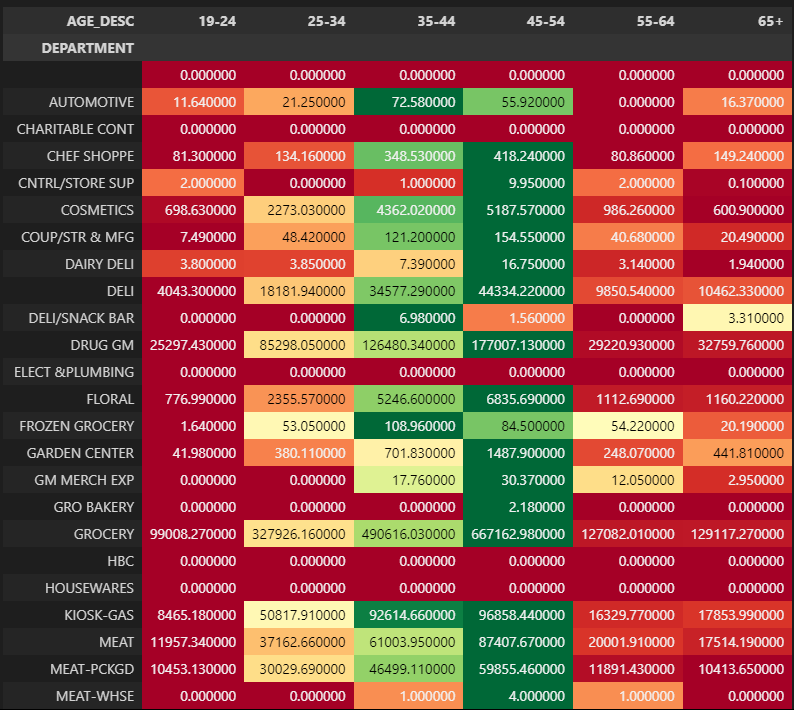

# Maven Mega Mart

Maven MegaMart is a multinational corporation that operates a chain of retail and grocery stores. They recently received a sample of data from a new retailer 
they’re looking to acquire, and they need to identify and deliver key insights about their sales history.
<br/>

**Our task is to analyze over 2 million transactions by product, household, and store to get a better understanding of the retailer’s main strengths.**
<br/>
From there, we need to review the company’s discount scheme to assess whether they can expect to attract customers without losing margin.

<br/>

We are using Python to:
- Read in multiple flat files efficiently.
- Join tables to provide a single source of information.
- Shape & aggregate sales data to calculate KPIs.
- Visualize the data to communicate the findings.

We will be using few DataFrames:
- Transactions: the primary DaraFrame 
- Products: contains the data of Brand and Department for the category of our data.
- Households: to analyze our sales figures by some of these demographic qualities.

We also going to combine our data in some way to perform these analysis.

### Key Objectives
- Read in data from multiple CSV files
- Explore the data ( millions of rows )
- Join multiple DataFrames
- Filter, sort, and aggregate the data to pipoint and summarize important information
- Work with datetime fields to analyze time series
- Build plots to communicate key insights
- Optimize the import workflow
- Write out summary tables for stakeholders


## Transaction Dataframe
To start our analysis we :
* First, read in the ```transactions``` data.
* Read in the columns household_key, basket_id, STORE_ID, DAY, QUANTITY, and SALES_VALUE.
* Convert DAY, QUANTITY, and STORE_ID to the smallest appropriate integer type.

#### Read the data and work on the columns
```
path = "data/project_transactions.csv"
cols = ["household_key", "BASKET_ID", "DAY", "PRODUCT_ID", "QUANTITY", "SALES_VALUE"]
dtypes = {
    "DAY": "Int64",
    "QUANTITY": "Int32",
    "STORE_ID": "Int32"
}

transactions = pd.read_csv(path, dtype=dtypes, usecols=cols)
```


#### Now we need to create Data column based on the value of 'DAY' for `transaction` table and drop the `"DAY"` column
```
transactions = transactions.assign(
    Date = (pd.to_datetime("2016", format='%Y')
    + pd.to_timedelta(transactions["DAY"].sub(1).astype(str) + ' days'))
).drop(["DAY"], axis=1)
```


### Time Based Analysis
In this analysis on ```transaction``` dataframe we will:
* Plot the sum of sales by month. Are sales growing over time?
* Plot the same series after filtering down to dates April 2016 and October 2017.
* Plot the sum of monthly sales in 2016 vs the monthly sales 2017.
* Finally, plot total sales by day of week.

### _ Sales by Month
To have a full set of household observations we should filter down the date. By applying the specific date, we have a nice steady growth month over month, which shows we have a healthy company.

```
(transactions.set_index("Date")
.loc["2016-04": "2017-10", "SALES_VALUE"]
.resample("M")
.sum()
.plot())
plt.title("Sales by Month")
```


### _ Sales by Year

```
(transactions.set_index("Date")
.loc[ :, ["SALES_VALUE"]]
.resample("M")
.sum()
.assign(year_prior = lambda x: x["SALES_VALUE"].shift(12))    #creates a new column for the dataframe, year_prior, which shifts our date down by 12 to get the year data
.loc["2017"]
.plot()
)
plt.figure(figsize=(4, 3))
```


Ignoring the ramp of from Jan 2016 ( line orange ) and the sharp decline in the last month of 2017 ( line blue ), we can see clearly our overal of 2017 sales are higher than 2016. We also see a couple similar seasonal fluctuations that do look much stronger in 2017.


### _ Total Sales by Week-Day
```
(transactions.groupby(transactions["Date"].dt.day_of_week)
.agg({"SALES_VALUE" : "sum"})
.plot.bar())
plt.title("Total Sales by Week Day")
```


Based on the bar chart, highest sales are on Monday and Tuesday followed by Sunday. It might be interesting to dive further into why more customers are coming in on these days.

### Sum of Sales by Households


<br/>

## Demographics Dataframe
We want to understand the composition of our customers and which are our strongest customer segments?

So, we're going to :
* Read in the hh_demographic.csv file, but only columns AGE_DESC, INCOME_DESC, household_key, and HH_COMP_DESC.
* Convert the appropriate columns to the category dtype.
* Group the transactions table by hosehold_id, and calculate the sum of Sales Value by household, and create aggregated household sales DataFrame.
* Join the demographics DataFrame to the aggregated transactions table. Since we're interested in analyzing the demographic data we have, make sure not to include rows from transactions that don't match.
* Plot the sum of sales by age_desc and income_desc, in seperate charts - to have a summary of total sales by these categories.
* Create a pivot table of the mean household sales by AGE_DESC and HH_COMP_DESC. 
* Finally, check Which of our demographic have the highest average sales? - to understand potential marketing strategies and complementary benefits with Maven own customer base.

```
# read in sub sets of the columns, then
# convert these column to category data type, to save ton of data for further join to transactions table, and having repeated column 
dem_cols = ["AGE_DESC", "INCOME_DESC", "household_key", "HH_COMP_DESC"]
dem_dtypes = {"AGE_DESC": "category", "INCOME_DESC": "category", "HH_COMP_DESC": "category"}
demographics = pd.read_csv("data/hh_demographic.csv", usecols=dem_cols, dtype=dem_dtypes)
```


<br/>
### Join ```household``` table to ```demographic``` table
To analyze the demographics of our households
```
household_sales_demo = (household_sales.merge(demographics,
                        how="inner",
                        left_on= "household_key",
                        right_on= "household_key"
                        ))
```


We have 668 households for analysis.

### Sum of Sales value by Age category


### Sum of Sales value by Income category


This is the most common household income demographis in the US, but it worth nothing that even our under-15K and 25-34K demographics are much higher than some of the higher income demographic. so, if we are looking at the discount retailor, it makes sense that we're attracting a lot of these lower income groups and this is expected by a leadership.

### Household Composition Heatmap
To show the households composition by a heat-map. This shows us which our demographic is producing the most revenue by household, and also aloow us to think about ways we can combine our strategy in terms of marketing with our aquisition targets.
```
(household_sales_demo.pivot_table(index="AGE_DESC",
                                  columns="HH_COMP_DESC",
                                  values="SALES_VALUE",
                                  aggfunc="mean",
                                  margins=True)
                     .style.background_gradient(cmap="RdYlGn", axis=None)
 ```
 
 
 
The heatmap shows that our average sales for single parent homes at a young age (19-24) have a very high sales. so, we should figure out how to help these single family homes as part of shopping experience. we might also look at focusing on families with children in general; is there a way that we can revamp our product distribution, is there a way that we can target our marketing more specificly towards these groups.

<br/>

## Product Dataframe
For this analysis we will:
* Read in the product csv file.
* Only read in product_id and department from the product table.
* Join the product DataFrame to the original transactions and demographics tables, performing an inner join when joining both tables.
* Finally, pivot the fully joined dataframe by AGE_DESC and DEPARTMENT, calculating the sum of sales. 
* and take a look ate Which category is led by our youngest age demographic?


<br/>

## Join All Tables Toghether
```
trans_demo_dept = (transactions.merge(demographics, how="inner", left_on="household_key", right_on="household_key")
                               .merge(product, how="inner", left_on="PRODUCT_ID", right_on="PRODUCT_ID")
                  )

trans_demo_dept.head()
```


<br/>

## Department by Age
This pivot table helps us to to look at the areas among young customers. Are they going to be our next generation of customers for the company?
```
(trans_demo_dept.pivot_table(
    index="DEPARTMENT", 
    columns="AGE_DESC",
    values="SALES_VALUE",
    aggfunc="sum"
    ).style.background_gradient(cmap="RdYlGn", axis=1)
)
```




The young customers are interested in SPIRITS ( alcohol )!


<br/>


### Export Pivot Table to an Excel File
```
(trans_demo_dept.pivot_table(
                            index="DEPARTMENT",
                            columns="AGE_DESC",
                            values="SALES_VALUE",
                            aggfunc="sum"
                            ).style.background_gradient(cmap="RdYlGn", axis=1)
                            .to_excel("demographic_category_sales.xlsx", sheet_name="sales_pivot")
)
```


